# 🇬🇧 UK AI News

An automated news aggregator that curates artificial intelligence and machine learning articles focused on the United Kingdom. Articles are automatically discovered, summarized, and classified using AI, with a conversational chat interface powered by RAG (Retrieval-Augmented Generation).

**Live Demo**: [news-crawler-ochre.vercel.app](https://news-crawler-ochre.vercel.app)

## ✨ Features

- **Automated Article Discovery** - Weekly crawls find new AI/ML articles with UK focus
- **AI Summarization** - Each article is summarized using Azure OpenAI GPT-4
- **Sentiment Classification** - Articles are classified as positive, neutral, or negative
- **Semantic Search** - Vector embeddings enable intelligent article retrieval
- **RAG Chat Assistant** - Ask questions and get answers based on collected articles
- **Dark/Light Mode** - Modern, responsive UI with theme support
- **GitHub OAuth** - Secure admin access for article management

## 🏗️ Architecture

### Automated Weekly Crawl (GitHub Actions)

```mermaid
flowchart LR
    GHA["⏰ GitHub Actions<br/>Weekly Cron"] --> DDGS["🔍 DuckDuckGo"]
    DDGS --> SCRAPE["📄 Scrape Articles"]
    SCRAPE --> AZURE["🤖 Azure OpenAI"]
    AZURE --> |"Summarize<br/>Classify<br/>Embed"| NEON[("🗄️ Neon PostgreSQL<br/>+ pgvector")]
```



### User Interaction (Vercel App)

```mermaid
flowchart LR
    USER["👤 User"] --> NEXT["⚡ Next.js<br/>Frontend"]
    NEXT --> API["🐍 FastAPI<br/>Backend"]
    API --> NEON[("🗄️ Neon PostgreSQL")]
    API --> AZURE["🤖 Azure OpenAI"]
    AZURE --> |"RAG Response"| API
    NEON --> |"Similar Articles"| API
    API --> NEXT
    NEXT --> USER
```



### Admin Flow (GitHub OAuth)

```mermaid
flowchart LR
    ADMIN["🔐 Admin"] --> |"Login"| GITHUB["GitHub OAuth"]
    GITHUB --> |"Verify"| NEXT["⚡ Next.js"]
    NEXT --> |"Delete"| API["🐍 FastAPI"]
    API --> NEON[("🗄️ Neon PostgreSQL")]
```



## 🔄 Data Flow


## 🛠️ Tech Stack

| Layer | Technology |
|-------|------------|
| **Frontend** | Next.js 14, React, TypeScript, Tailwind CSS |
| **Backend** | FastAPI (Python), Serverless Functions |
| **Database** | Neon PostgreSQL + pgvector |
| **AI** | Azure OpenAI (GPT-4, text-embedding-ada-002) |
| **Auth** | NextAuth.js + GitHub OAuth |
| **Hosting** | Vercel |
| **CI/CD** | GitHub Actions |

## 📁 Project Structure

```
news-crawler/
├── app/                    # Next.js pages and routes
│   ├── api/auth/          # NextAuth.js API routes
│   └── page.tsx           # Main application page
├── backend/
│   ├── main.py            # FastAPI application
│   ├── crawl_articles.py  # Standalone crawl script
│   ├── config.json        # Azure OpenAI config
│   └── requirements.txt   # Python dependencies
├── components/            # React UI components
├── lib/                   # Utilities and auth config
├── keywords.txt           # Search terms for crawling
└── .github/workflows/     # GitHub Actions
    └── weekly-crawl.yml   # Automated crawl workflow
```

## 🚀 Deployment

### Prerequisites

- Vercel account
- Neon PostgreSQL database with pgvector extension
- Azure OpenAI resource with GPT-4 and embedding deployments
- GitHub OAuth App

### Environment Variables

**Vercel (Frontend + Backend):**
```
POSTGRES_URL=postgresql://...
AZURE_OPENAI_KEY=...
AZURE_OPENAI_ENDPOINT=https://...
GITHUB_ID=...
GITHUB_SECRET=...
NEXTAUTH_SECRET=...
NEXTAUTH_URL=https://your-app.vercel.app
NEXT_PUBLIC_ALLOWED_GITHUB_USERNAME=your-github-username
```

**GitHub Actions Secrets:**
```
POSTGRES_URL=postgresql://...
AZURE_OPENAI_KEY=...
AZURE_OPENAI_ENDPOINT=https://...
```

### Database Setup

Run these SQL commands in your Neon dashboard:

```sql
CREATE EXTENSION IF NOT EXISTS vector;

CREATE TABLE IF NOT EXISTS articles (
    id UUID PRIMARY KEY DEFAULT gen_random_uuid(),
    title TEXT NOT NULL,
    url TEXT UNIQUE NOT NULL,
    summary TEXT,
    date_published TEXT,
    date_added TIMESTAMPTZ DEFAULT NOW(),
    is_public BOOLEAN DEFAULT true,
    source TEXT,
    content_type TEXT,
    region TEXT,
    sentiment TEXT,
    embedding vector(1536)
);

CREATE INDEX IF NOT EXISTS articles_embedding_idx ON articles 
USING ivfflat (embedding vector_cosine_ops) WITH (lists = 100);
```

## 🔧 Local Development

### Backend

```bash
cd backend
conda create -p ./backend-env python=3.11
conda activate ./backend-env
pip install -r requirements.txt

# Create .env with your credentials
cd ..
uvicorn backend.main:app --reload
```

### Frontend

```bash
npm install
npm run dev
```

### Manual Article Crawl

```bash
# Uses keywords.txt and writes to your Neon database
python backend/crawl_articles.py
```

## 📅 Automated Crawling

The GitHub Actions workflow (`weekly-crawl.yml`) runs every Monday at 6 AM UTC:

1. **Triggers** on schedule or manual dispatch
2. **Reads** search terms from `keywords.txt`
3. **Searches** DuckDuckGo for UK AI articles
4. **Scrapes** article content (respects robots.txt)
5. **Filters** inappropriate content
6. **Summarizes** using GPT-4
7. **Classifies** sentiment (positive/neutral/negative)
8. **Generates** embeddings for vector search
9. **Stores** in PostgreSQL with pgvector

To trigger manually: Go to **Actions** → **Weekly Article Crawl** → **Run workflow**

## 🔐 Authentication

Only the configured GitHub user (`NEXT_PUBLIC_ALLOWED_GITHUB_USERNAME`) can:
- Delete articles from the database

All other users can:
- Browse articles
- Use the chat assistant
- Filter and search

## 📝 API Endpoints

| Method | Endpoint | Description |
|--------|----------|-------------|
| `GET` | `/articles` | List all articles |
| `DELETE` | `/articles/{id}` | Delete article (auth required) |
| `POST` | `/ask` | Ask a question (non-streaming) |
| `POST` | `/ask/stream` | Ask a question (streaming) |
| `GET` | `/articles/stats` | Get collection statistics |
| `POST` | `/articles/classify-sentiment` | Classify unclassified articles |
| `GET` | `/health` | Health check |

## 📄 License

MIT

---

Built with ❤️ by [@r-leyshon](https://github.com/r-leyshon)
